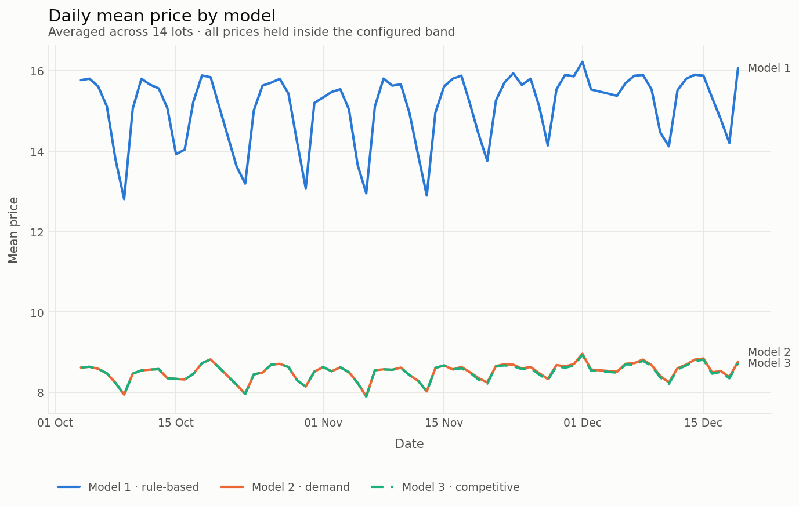
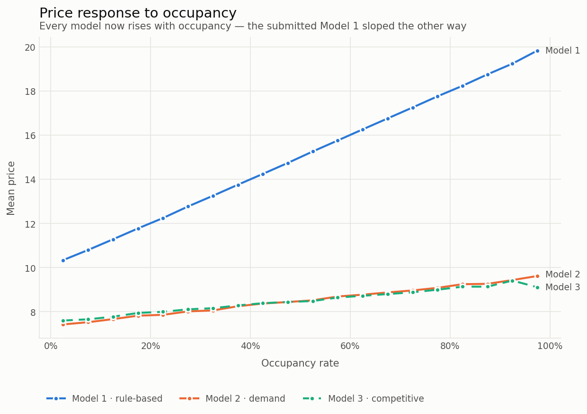
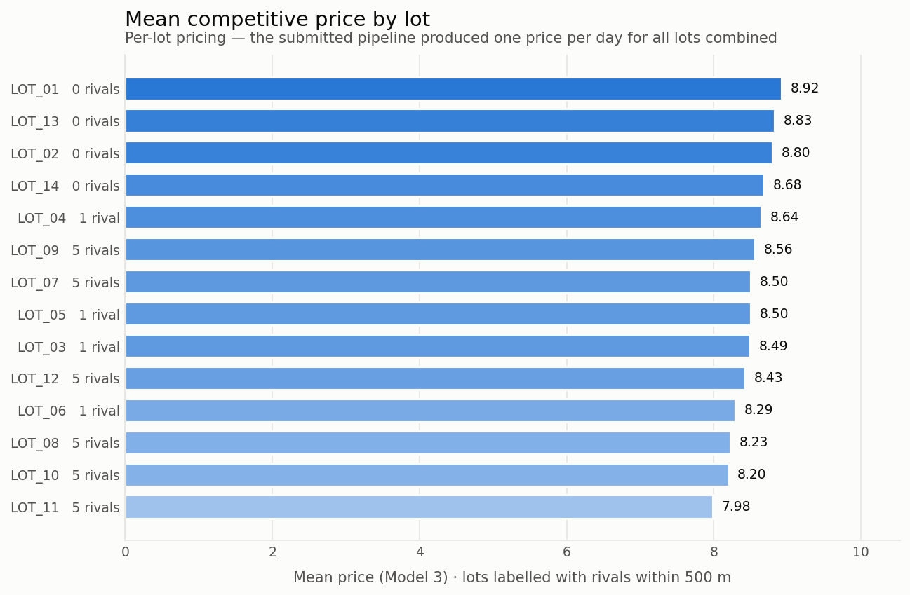
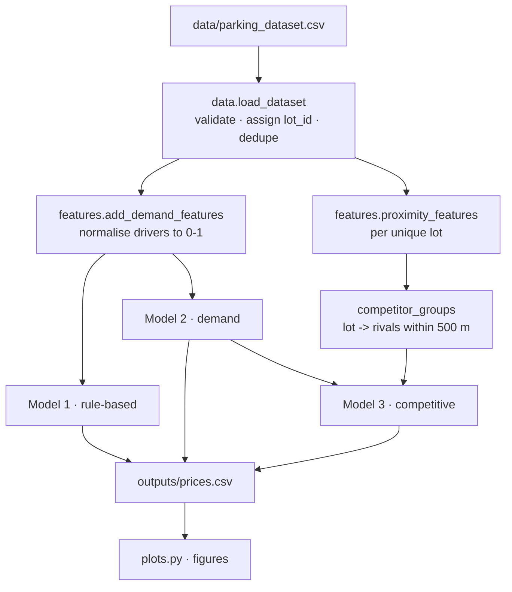

# Dynamic Pricing for Urban Parking Lots

[](https://github.com/shambhavi1635/capstoneproject/actions/workflows/tests.yml)

Three pricing models over 14 urban parking lots, 1,300 timesteps each, from
4 October to 19 December 2016. Each model prices **every lot at every
timestep**, and every price is held inside a configured band around the base
price.

| Model | Idea | Price |
|---|---|---|
| **1 · Rule-based** | Fuller lot, higher price | `base · (1 + α · occupancy)` |
| **2 · Demand** | Weighted demand from occupancy, queue, traffic, special days, vehicle mix | `base · (1 + λ · (demand_norm − ½))` |
| **3 · Competitive** | Model 2, pulled toward nearby lots' prices | Model 2 ± competitor gap, minus a full-lot discount |



---

## Quick start

```bash
pip install -e .
```

```bash
parking-pricing --plots
```

That writes `outputs/prices.csv` (one row per lot per timestep),
`outputs/daily_summary.csv`, and three figures. Add `--report` for the
model-comparison table. Expected output:

```
Priced 18,282 lot-timestamps across 14 lots
  2016-10-04 07:59:00  ->  2016-12-19 16:30:00
  price band: 5.00 - 20.00
  price_model1  mean  15.10  min  10.03  max  20.00
  price_model2  mean   8.52  min   5.10  max  14.75
  price_model3  mean   8.50  min   5.13  max  14.75
```

`pip install -e .` puts the `parking-pricing` command on your path. To run from
a checkout without installing, use `PYTHONPATH=src python -m parking_pricing.cli`
instead (`set PYTHONPATH=src` on Windows `cmd`).

Run the tests — `pytest` picks up `src/` from `pyproject.toml`, so no install is
needed:

```bash
pip install pytest && python -m pytest
```

### Using it as a library

```python
from parking_pricing import PricingConfig, run_pipeline

prices = run_pipeline(cfg=PricingConfig(base_price=20.0))
prices.groupby("lot_id")["price_model3"].mean()
```

---

## Results

### Price responds to occupancy — in the right direction



All three models rise with occupancy. Model 3 turns *down* above ~90% occupancy:
that is the full-lot rule, shedding price to divert drivers to a cheaper
neighbour rather than letting a queue build at the gate.

### Isolated lots charge the most



The four lots with no rival within 500 m hold the highest mean prices. The six
co-located lots — all within metres of one another — are pulled down toward each
other and occupy the bottom of the table. This is the competitive mechanism
doing visible work, and it is only observable because pricing is now per-lot.

### Competition makes pricing steadier

```bash
parking-pricing --report
```

| model | mean | std | volatility | band saturation | occupancy corr |
|---|---|---|---|---|---|
| 1 · rule-based | 15.10 | 2.45 | 0.43 | 1.4% | 1.000 |
| 2 · demand | 8.52 | 1.36 | 1.37 | 0% | 0.417 |
| 3 · competitive | 8.50 | 1.12 | **1.11** | 0% | 0.394 |

*Volatility* is the mean absolute price change between consecutive timesteps for
a lot. Model 3 is **19% less volatile than Model 2** while tracking occupancy
almost as closely: being pulled toward neighbours damps the swings that Model 2
makes on its own. For a price posted on a sign at the entrance, that steadiness
is worth the small loss in responsiveness.

Model 1 scores a perfect 1.000 correlation only because it *is* a function of
occupancy and nothing else — that is a tautology, not a merit.

The competitive adjustment also checks out against its own control group:

| | lots | mean abs shift | max abs shift |
|---|---|---|---|
| isolated | 4 | **0.0000** | **0.0000** |
| has rivals | 10 | 0.3929 | 3.1808 |

Lots with no rival inside the radius move by exactly zero, as they must. Without
that control the other row would be uninterpretable.

---

## How it works



| Module | Responsibility |
|---|---|
| [`config.py`](src/parking_pricing/config.py) | Every tunable constant, as dataclasses |
| [`data.py`](src/parking_pricing/data.py) | Loading, validation, lot identity, deduplication |
| [`features.py`](src/parking_pricing/features.py) | Haversine geography, competitor sets, demand normalisation |
| [`models.py`](src/parking_pricing/models.py) | The three pricing models |
| [`evaluate.py`](src/parking_pricing/evaluate.py) | Behavioural metrics comparing the models |
| [`pipeline.py`](src/parking_pricing/pipeline.py) | Orchestration and output |
| [`plots.py`](src/parking_pricing/plots.py) | Headless figures |
| [`cli.py`](src/parking_pricing/cli.py) | Command-line entry point |

### Design decisions worth knowing

**Prices are clamped.** Every model's output is clipped to `[0.5×, 2×]` the base
price. An unbounded dynamic price is not a pricing policy; it is a liability.

**Normalisation bounds come from the weights, not the data.** Model 2 derives
its demand range from the configured coefficients, so an individual row prices
identically whether it arrives alone or inside a batch. A model whose output
depends on what else is in the window cannot be deployed against a live stream.

**A lot is never its own competitor.** Proximity is computed on one row per lot,
and the function raises if handed a per-timestamp frame — the exact mistake that
produced "1,312 competitors" in the original.

### Tuning

Everything adjustable lives in [`config.py`](src/parking_pricing/config.py):

```python
from parking_pricing import PricingConfig, run_pipeline
from parking_pricing.config import Model2Config

cfg = PricingConfig(
    base_price=15.0,
    competitor_radius_m=1000.0,
    model2=Model2Config(traffic_weight=0.7),   # traffic raises price instead
)
prices = run_pipeline(cfg=cfg)
```

---

## Data

`data/parking_dataset.csv` — 18,368 rows, 14 lots, 1,312 timesteps each.

| Column | Meaning |
|---|---|
| `Latitude`, `Longitude` | Lot coordinates; these identify the lot |
| `Timestamp` | Reading time |
| `Occupancy`, `Capacity` | Vehicles parked, and spaces available |
| `QueueLength` | Vehicles waiting (0–10) |
| `TrafficLevel` | 0 low, 1 medium, 2 high |
| `IsSpecialDay` | 1 on event or holiday dates |
| `VehicleTypeWeight` | 1.0 small, 1.5 SUV, 2.0 EV |

`QueueLength`, `TrafficLevel`, `IsSpecialDay` and `VehicleTypeWeight` are
**simulated**, not observed. They were generated once and committed so results
are reproducible; the original script regenerated them unseeded on every run.

Loading drops 86 rows: 152 rows share a `(lot, timestamp)` with another row, and
each such group is collapsed to one reading. See
[`docs/model-changes.md` §9](docs/model-changes.md).

---

## Streaming

The original ran through [Pathway](https://pathway.com/) with Bokeh dashboards.
The core pipeline deliberately does not depend on either: Pathway publishes no
wheels for Python 3.13 and does not run natively on Windows, which would make
the project unrunnable for most readers.

To use the streaming stack, on Python 3.10–3.12:

```bash
pip install -r requirements-streaming.txt
```

The models in `models.py` are pure functions of a row's features, so they port
to a streaming operator without change — that is what the weight-derived
normalisation in Model 2 buys.

---

## What changed from the submitted version

The original Colab export is preserved unmodified at
[`legacy/capstone1_colab.py`](legacy/capstone1_colab.py). It did not run: it
began with `!pip install`, shadowed `datetime` so the windowing call raised
`AttributeError`, counted each lot's own repeated rows as 1,312 nearby
competitors, priced an empty lot at 327 against a base of 10, and collapsed all
14 lots into a single price per day.

**[`docs/model-changes.md`](docs/model-changes.md) documents all ten defects,**
each verified against the committed output files, along with what was
deliberately *not* changed and the limitations that remain.

---

## Report

[Dynamic Pricing for Urban Parking Lots](Dynamic_Pricing_for_Urban_ParkingLots.pdf) (PDF, in this repository)

## Tech stack

Python 3.10+ · pandas · NumPy · Matplotlib · pytest.
Optional: Pathway, Bokeh, Panel for the streaming path.
